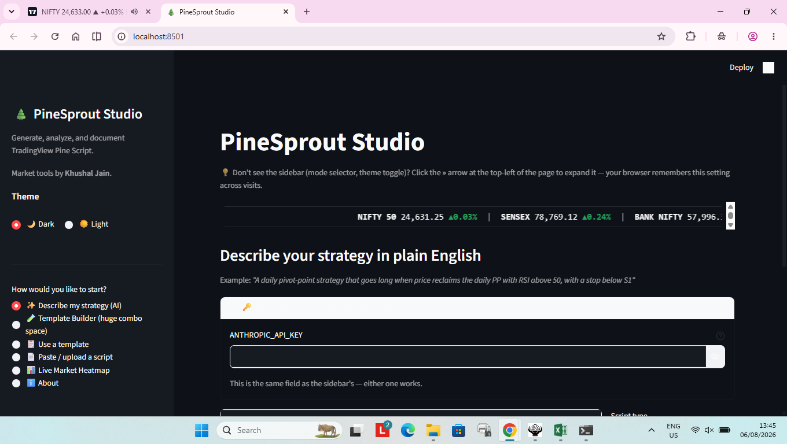
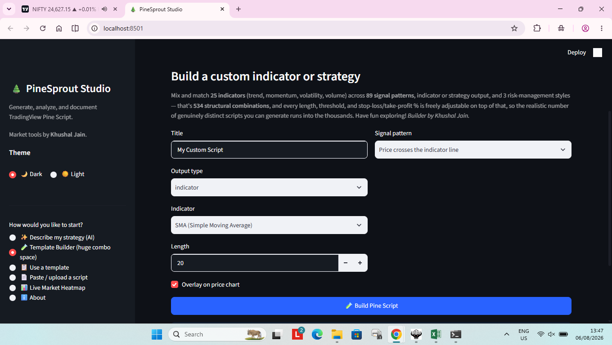
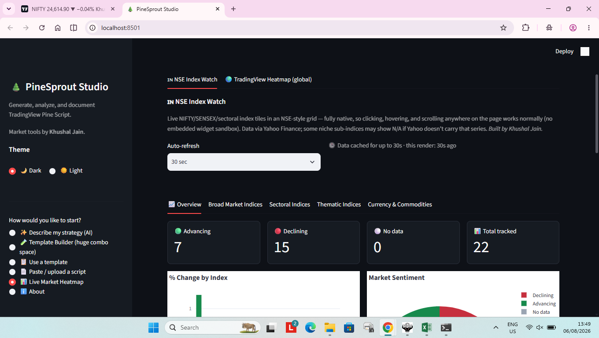
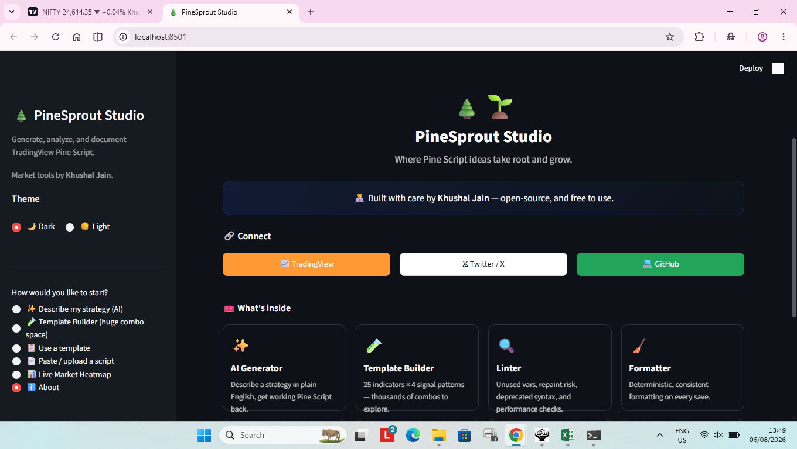
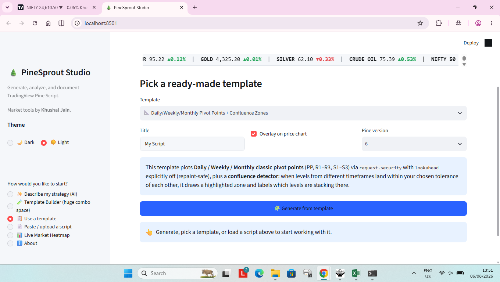

# PineSprout

**PineSprout** is a production-grade command-line toolkit for [TradingView Pine
Script](https://www.tradingview.com/pine-script-docs/) developers. It helps
you generate, format, lint, analyze, optimize, explain, upgrade, and
document Pine Script indicators, strategies, and libraries — all from a
single, fast CLI.

> ⚠️ PineSprout only ever operates on Pine Script source files **you
> provide**. It does not fetch, decompile, or bypass protection on
> TradingView's invite-only or protected scripts.

[](https://github.com/85599/pinesprout/actions/workflows/ci.yml)
[](https://pypi.org/project/pinesprout/)
[](https://www.python.org/)
[](LICENSE)

---

## Features

| Command | Description |
|---|---|
| `pinesprout generate "<prompt>"` | Generate a new indicator/strategy/library from a natural-language prompt (Claude-powered) |
| `pinesprout format <file>` | Deterministically format Pine Script source |
| `pinesprout lint <file>` | Detect unused variables, repaint risk, deprecated syntax, and performance issues |
| `pinesprout analyze <file>` | Structural & complexity analysis of an indicator/strategy |
| `pinesprout optimize <file>` | Suggest (and optionally apply) performance/readability refactors |
| `pinesprout explain <file>` | Line-by-line, plain-English explanation of a script |
| `pinesprout upgrade <file>` | Migrate Pine Script v4 → v5 → v6 |
| `pinesprout template new <kind>` | Scaffold new indicators/strategies from built-in templates |
| `pinesprout readme <file>` | Generate a `README.md` for a script |
| `pinesprout docs <file>` | Generate HTML or Markdown documentation |
| `pinesprout report <file>` | Generate a full strategy/indicator analysis report |
| `pinesprout history` | View recent PineSprout command history (SQLite-backed) |
| `pinesprout plugins list` | List discovered plugins |

Every command supports `--json` for machine-readable output, making
PineSprout easy to wire into CI pipelines, editors, and other tools.

## Installation

```bash
pip install pinesprout
```

Requires **Python 3.12+**. Works on Linux, macOS, and Windows.

For AI-powered generation (`pinesprout generate`), set an Anthropic API key:

```bash
export ANTHROPIC_API_KEY="sk-ant-..."
```

## Quick start

```bash
# Scaffold a new EMA-crossover indicator
pinesprout template new ema-cross-indicator --title "My EMA Cross" -o my_indicator.pine

# Lint it
pinesprout lint my_indicator.pine

# Format it
pinesprout format my_indicator.pine --write

# Analyze complexity & structure
pinesprout analyze my_indicator.pine

# Generate documentation
pinesprout docs my_indicator.pine --format markdown -o DOCS.md
pinesprout readme my_indicator.pine -o README.md

# Upgrade an old v4 script to v6
pinesprout upgrade legacy_strategy.pine --to 6 --write

# Ask Claude to write a new strategy from scratch
pinesprout generate "An RSI + volume confirmation strategy with ATR-based stops" \
  --type strategy -o my_strategy.pine
```

## Architecture

```
pinesprout/
├── cli.py                 # Typer CLI entry point (all subcommands)
├── config.py               # Pydantic settings (env vars + pinesprout.toml)
├── core/                   # Parsing, formatting, linting, analysis engines
│   ├── lexer.py             # Regex-based Pine Script tokenizer
│   ├── parser.py             # Lightweight AST builder
│   ├── ast_nodes.py           # Typed AST node definitions
│   ├── formatter.py            # Deterministic code formatter
│   ├── linter.py                # Static analysis rule engine
│   ├── analyzer.py               # Structural/complexity analysis
│   ├── optimizer.py               # Refactor suggestion engine
│   ├── explainer.py                # Line-by-line explanations
│   ├── upgrader.py                  # v4 -> v5 -> v6 migrations
│   └── version_rules.py              # Deprecated symbols & migration rules
├── generators/              # Output generation
│   ├── ai_generator.py       # Claude-powered code generation
│   ├── template_generator.py  # Jinja2-based deterministic scaffolds
│   ├── readme_generator.py     # README.md generation
│   ├── doc_generator.py         # HTML/Markdown docs
│   └── report_generator.py       # Analysis reports
├── plugins/                 # Plugin system (entry points + local plugins)
├── db/                      # SQLite-backed run history
├── templates/                # Jinja2 templates (.pine.j2, .md.j2, .html.j2)
└── utils/                    # Console, JSON output, file helpers
```

### Why a custom parser instead of tree-sitter/ANTLR?

TradingView does not publish or maintain an official tree-sitter or ANTLR
grammar for Pine Script. Rather than depend on an unofficial, potentially
stale third-party grammar, PineSprout ships a small, well-tested,
dependency-free lexer/parser (`core/lexer.py`, `core/parser.py`) whose
output shape mirrors a tree-sitter concrete syntax tree (typed nodes,
line/column spans, a `children` list). This keeps PineSprout robust against
real-world Pine Script's many edge cases while leaving a clean seam to
swap in an official grammar later, without touching the formatter, linter,
analyzer, or any other downstream consumer.

## Plugin system

Extend PineSprout with custom lint rules or CLI commands:

```python
# .pinesprout/plugins/my_rules.py
from pinesprout.plugins.base import PineSproutPlugin, LintRule
from pinesprout.core.linter import LintIssue, Severity, LintCategory

class NoMagicColorsRule(LintRule):
    name = "no-magic-colors"

    def check(self, source: str) -> list[LintIssue]:
        issues = []
        for i, line in enumerate(source.splitlines(), start=1):
            if "color=color.red" in line:
                issues.append(LintIssue(
                    line=i, severity=Severity.INFO,
                    category=LintCategory.STYLE,
                    message="Avoid hard-coded colors; expose as an input.",
                ))
        return issues

class MyPlugin(PineSproutPlugin):
    name = "my-org-rules"
    version = "1.0.0"

    def lint_rules(self):
        return [NoMagicColorsRule()]

PLUGIN = MyPlugin()
```

Packaged plugins can also register via a `pinesprout.plugins` entry point.
See [`pinesprout/plugins/loader.py`](pinesprout/plugins/loader.py) for
details.

## PineSprout Studio (Streamlit UI)

Prefer a browser over the CLI? `streamlit_app.py` wraps PineSprout in an
interactive UI — describe a strategy in plain English (AI-generated),
pick a template (including a full **Daily/Weekly/Monthly Pivot Points +
Confluence Zones** indicator), or paste your own script, then lint,
format, analyze, optimize, explain, upgrade, and document it with
one-click downloads.

It also includes:
- 📡 A **live scrolling market ticker** (NIFTY 50, SENSEX, BANK NIFTY,
  and commodities via yfinance) shown at the top of the app.
- 🧪 A **Template Builder**: mix 25 indicators (trend, momentum,
  volatility, volume) across 4 signal patterns, indicator/strategy
  output, and 3 risk-management styles, with every length/threshold/
  stop-loss % freely adjustable — thousands of genuinely distinct,
  lint-clean scripts to explore.
- 📊 **"Live Market Heatmap"** mode with two tabs: a 🇮🇳 **NSE-style
  Index Watch** (native Streamlit card grid — NIFTY, SENSEX, sectoral
  indices, fully interactive, no iframe) and a 🌍 **TradingView Stock
  Heatmap** widget for global markets (US, Europe, Asia-Pacific by
  exchange).
- 🌓 A **dark/light theme toggle** in the sidebar that actually themes
  every native widget, including the header/toolbar, not just the
  background.
- ℹ️ An **About** page with developer links (custom-colored: saffron
  TradingView, white X/Twitter, green GitHub) and a feature showcase.

*Market tools by Khushal Jain.*

### Screenshots

| | |
|---|---|
|  |  |
| ✨ Describe a strategy, get Pine Script back | 🧪 Template Builder — 25 indicators × 4 signal patterns |
|  |  |
| 📊 NSE-style Index Watch + TradingView heatmap | ℹ️ About page with developer links |

<details>
<summary>Light theme</summary>



</details>

> **Note:** these screenshots were captured in a sandboxed environment with no
> internet access to Yahoo Finance, so the ticker/heatmap show "N/A" — on a
> normal machine with internet access they show live prices.

```bash
pip install -e ".[dev]"
streamlit run streamlit_app.py
```

See [`docs/streamlit-app.md`](docs/streamlit-app.md) for the full guide,
including deploying to Streamlit Community Cloud.

## Development

```bash
git clone https://github.com/85599/pinesprout.git
cd pinesprout
pip install -e ".[dev]"
pytest
ruff check .
mypy pinesprout
```

## Contributing

Issues and pull requests are welcome. Please run `pytest` and `ruff
check .` before submitting.

## License

[MIT](LICENSE)
